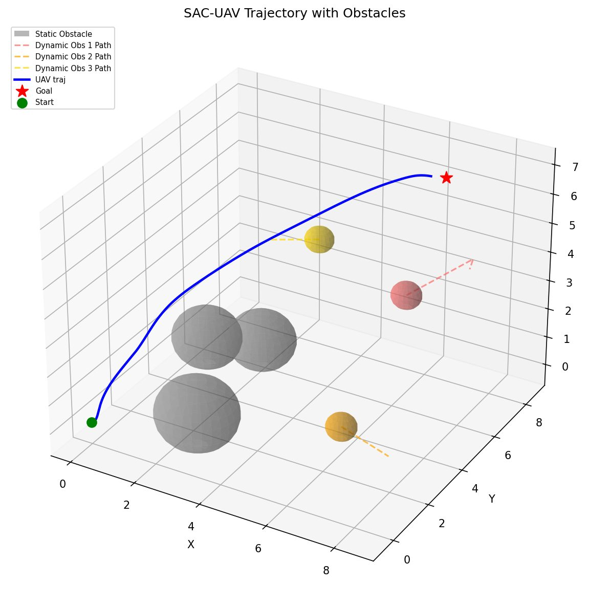
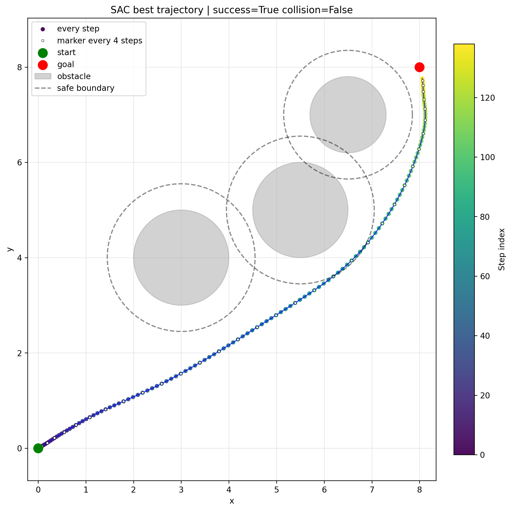
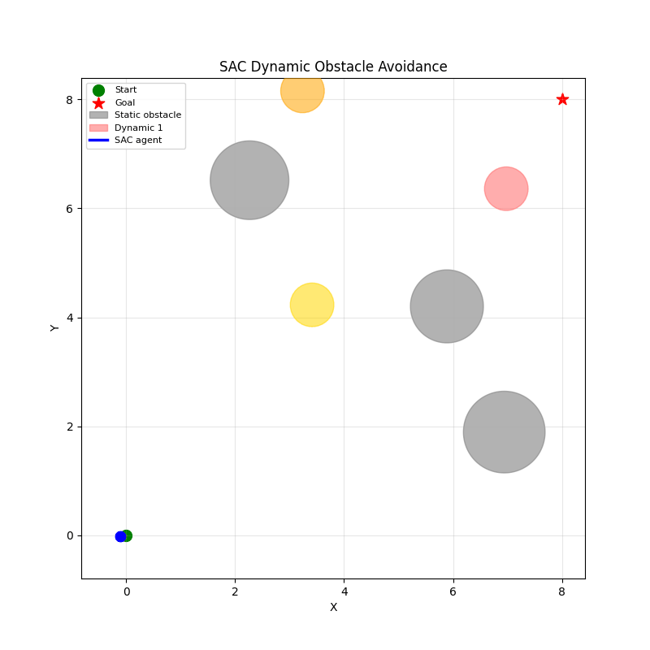

# SAC Obstacle Avoidance

基于 **PyTorch Soft Actor-Critic（SAC）** 的连续控制避障实验，覆盖二维静态、二维动态、三维动态，以及三维策略接入四旋翼动力学的闭环仿真。

包含训练代码、三个可直接运行的预训练策略、原始训练日志、轨迹图和自动检查。无需 Gym 或 Stable-Baselines3。



## 场景

| 命令中的场景名 | 观测 / 动作维数 | 环境与任务 |
| --- | --- | --- |
| `static2d` | 13 / 2 | 固定圆形障碍物；奖励同时考虑到达、路径长度和时间 |
| `dynamic2d` | 18 / 2 | 随机静态与运动障碍物；12 方向射线传感器 |
| `dynamic3d` | 41 / 3 | 三维球形障碍物；32 方向 Fibonacci 球面传感器 |
| `uav` | 高层 41 / 3；动力学状态 17 维 | 三维 SAC 输出加速度，经姿态、角速度和电机控制闭环执行 |

质点环境的采样时间为 **0.05 s**，加速度和速度分别按各轴限制为 **±1.2** 和 **±2.0**。四旋翼动力学积分步长为 **0.01 s**。避障距离按质点到障碍物表面的距离计算。

## 安装

Python **3.10+**。从本仓库根目录运行：

```bash
python -m venv .venv
```

Windows PowerShell 激活环境：

```powershell
.\.venv\Scripts\Activate.ps1
```

Linux / macOS 激活环境：

```bash
source .venv/bin/activate
```

安装项目：

```bash
python -m pip install -e .
python -m sac_avoidance --help
```

使用 NVIDIA GPU 时，先根据 [PyTorch 官方安装说明](https://pytorch.org/get-started/locally/) 安装匹配的 CUDA 版本，再安装本项目。评估默认使用 CPU；训练默认自动选择设备。已有依赖的环境可执行 `python -m pip install --no-deps --no-build-isolation -e .`。

## 直接评估预训练策略

仓库已附带三个策略权重，无需重新训练，也无需下载模型：

```bash
python -m sac_avoidance evaluate --scenario static2d --episodes 20 --max-steps 420 --seed 10000 --output runs/static2d-eval
python -m sac_avoidance evaluate --scenario dynamic2d --episodes 30 --max-steps 500 --seed 10000 --output runs/dynamic2d-eval
python -m sac_avoidance evaluate --scenario dynamic3d --episodes 10 --max-steps 600 --seed 10000 --output runs/dynamic3d-eval
python -m sac_avoidance uav --seed 42 --output runs/uav-demo
```

也可使用等价的 `sac-avoidance` 命令。省略 `--output` 时自动生成带时间戳的目录；指定目录必须为空，避免覆盖旧实验。

评估输出包括：

- `summary.json`：成功、碰撞、越界、超时比例，以及步数、终点误差、净空和路径长度均值。
- `episodes.csv`：逐次结果；种子依次为 `seed, seed+1, ...`。
- `trajectory.png` / `rollout.npz`：第一个评估场景的图与数据，包含失败轨迹。
- `run_config.json`：命令配置、运行设备和软件版本。

UAV 输出 `summary.json`、`rollout.npz`、轨迹图和状态/控制图。

## 从头训练

```bash
python -m sac_avoidance train --scenario static2d --config configs/static2d.json --output runs/static2d-train
python -m sac_avoidance train --scenario dynamic2d --config configs/dynamic2d.json --output runs/dynamic2d-train
python -m sac_avoidance train --scenario dynamic3d --config configs/dynamic3d.json --output runs/dynamic3d-train
```

配置文件可省略；显式命令行参数覆盖 JSON。可配置回合数、单回合步数、评估间隔、评估次数、批量大小、回放容量、预热步数、设备、CPU 线程数和种子。静态场景训练中的评估时域保留原实验的 420 步。

快速检查训练链路（不用于判断收敛）：

```bash
python -m sac_avoidance train --scenario dynamic3d --episodes 2 --max-steps 16 --eval-every 1 --eval-episodes 1 --batch-size 8 --replay-size 128 --warmup-steps 0 --device cpu --output runs/smoke
```

训练结束后导出 `policy.pt`，可直接用于评估：

```bash
python -m sac_avoidance evaluate --scenario dynamic3d --checkpoint runs/dynamic3d-train/policy.pt --episodes 10
python -m sac_avoidance uav --checkpoint runs/dynamic3d-train/policy.pt
```

训练目录还保留各实验原有的日志、曲线和训练 checkpoint。`policy.pt` 仅包含策略网络；本项目统一 CLI 提供从头训练，**不提供完整断点恢复**。原训练 checkpoint 不等同于可逐步复现的恢复快照。

## 已有结果与复现范围

下表来自保留的历史日志，**不是本次整理重新训练得到的结果**：

| 场景 | 历史记录 | 结果 |
| --- | --- | --- |
| 二维静态 | 第 1140 回合，20 次评估 | 成功率 100%，碰撞率 0%，平均 138.2 步，路径长度约 11.965 |
| 二维动态 | 代表性单次推演 | 140 步到达、未碰撞，路径长度约 11.337，终点误差约 0.298 |
| 三维动态 | 回合标签 2400，10 次评估 | 成功率 100%，成功样本平均 119.0 步，平均最小净空约 1.087 |

二维静态只扰动起点；动态场景随机生成障碍物。历史训练时评估使用的随机数状态没有完整保存，因此新的独立种子评估不保证得到相同数字。二维动态单次成功不能解释为总体成功率。新评估器统计所有样本的实际步数；历史二维动态和三维动态的步数口径不同，详见 [实验与复现说明](docs/EXPERIMENTS.md)。

整理后的独立 CPU 评估（种子从 10000 开始）得到静态二维 **20/20**、动态二维 **29/30**、动态三维 **10/10** 成功。动态二维出现 1 次碰撞，全部逐次结果已保留。这些结果用于验证迁移后的运行链路，详见 [本地验证记录](docs/VALIDATION.md)。

 

## 结构

```text
.
├── src/sac_avoidance/
│   ├── static2d/       # 静态环境、SAC 网络与快速路径训练
│   ├── dynamic2d.py    # 二维动态环境与 SAC 训练器
│   ├── env3d.py        # 独立三维环境，不含 ADP 训练网络
│   ├── dynamic3d.py    # 三维 SAC 训练器
│   ├── uav.py          # 四旋翼模型与加速度控制桥接
│   ├── policies.py    # 可移植策略权重的加载与导出
│   ├── evaluation.py  # 独立种子评估和可视化
│   ├── cli.py          # 统一命令行
│   └── pretrained/    # 三个策略与 SHA-256 来源清单
├── configs/            # 三个默认训练配置
├── results/reference/  # 原始实验日志及来源清单
├── docs/               # 方法、复现、上传说明与示例图
├── tests/              # 数值检查和训练/评估集成检查
└── .github/workflows/  # Linux / Windows CPU 检查
```

## 验证

```bash
python -m unittest discover -s tests -v
```

检查覆盖观测维度、控制限幅、射线方向、随机种子复现、权重校验、SAC 梯度更新、模型导出/加载和四旋翼悬停平衡。GitHub Actions 配置为 Python 3.10 / 3.12 与 Linux / Windows；在线执行结果以上传后实际运行情况为准。

## 方法与边界

SAC 使用高斯随机策略、双 Q 网络、目标网络和自动熵温度。见 [数学模型与实现说明](docs/METHOD.md)。本项目保留原有奖励函数、网络结构和训练更新口径，便于追溯已有模型。

当前结果限于仿真：软奖励不构成碰撞规避或闭环稳定性的形式化证明。局部距离观测不含障碍物速度；动态任务具有部分可观测性。四旋翼模型包含姿态、电机动态和饱和，但没有覆盖风扰动、传感器延迟与真实飞行验证。

## 文献

Haarnoja, T., Zhou, A., Abbeel, P., & Levine, S. (2018). Soft Actor-Critic: Off-Policy Maximum Entropy Deep Reinforcement Learning with a Stochastic Actor. *Proceedings of ICML*, PMLR 80, 1861–1870. [PMLR](https://proceedings.mlr.press/v80/haarnoja18b.html)

Haarnoja, T., et al. (2018). Soft Actor-Critic Algorithms and Applications. *arXiv:1812.05905*. [arXiv](https://arxiv.org/abs/1812.05905)

## 上传 GitHub 与许可

上传步骤见 [GITHUB.md](docs/GITHUB.md)。训练产物默认被 `.gitignore` 排除，三个小型预训练策略被明确纳入版本管理。仓库不包含课程报告、个人编号、编辑器配置或完整回放池。

尚未指定开源许可证；公开仓库并不自动授予他人修改、再分发等许可。作者可在发布时自行选择许可证并填写权利人信息，见 [许可说明](LICENSE.md)。
